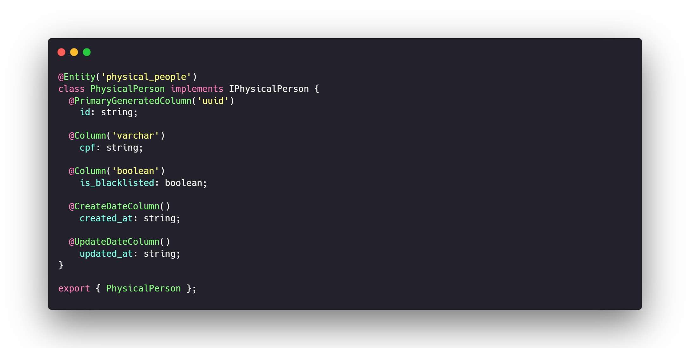
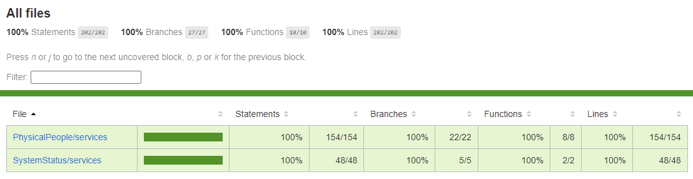

<h1 align="center">CPF Checker</h1>

<h1 align="center"></h1>

## ✨ Technologies

This project was developed using the following technologies:

- [Node](https://nodejs.org/en/)
- [TypeScript](https://www.typescriptlang.org/)
- [Express](https://expressjs.com/pt-br/)
- [SQLite](https://www.sqlite.org/index.html)
- [TypeORM](https://typeorm.io/#/)
- [Babel](https://babeljs.io/)
- [Celebrate](https://github.com/arb/celebrate)
- [Tsyringe](https://github.com/microsoft/tsyringe)
- [date-fns](https://date-fns.org/)
- [uuid](https://www.uuidgenerator.net/)
- [Jest](https://jestjs.io/pt-BR/)
- [Eslint](https://eslint.org/)
- [EditorConfig](https://editorconfig.org/)
- [Docker](https://www.docker.com/)
- [Docker-Compose](https://docs.docker.com/compose/)

## 💻 Project

Typescript Node application which you can create, update, list and check status from physical people, toggle them to blacklist, get server uptime in seconds and in human readable format, total physical people check since last server restart and total blacklisted physical people quantity.

## 🔧 Technologies choice

Project developed using Express framework to ensure all solid API environment under the hood, which guarantees the best request and response management, Babel to compile and create the native Javascript code bundle which enable Node runtime to run the project, TypeScript as the language to guarantee props and state values accordingly as expected from the contract, TypeORM to map the entities on the API same as in the database and handle it much easier, SQLite as the database to keep it as a simple file just for some light viewing of the project, Tsyringe to inject the dependencies on services, Date-fns to handle dates, uuid to generate universal unique identifications for the entities, Principle of S.O.L.I.D and Clean Code to promote clean maintenance and good coding practices also according to ESLint and EditorConfig, Jest to make the unitary test to the components, Docker with Dockerfile to create a Docker image from the API and Docker-Compose to run it.

 ## 🔨 Project Architecture

 ```
  src
  ├──modules
  └──shared
     ├──container
     │  └──providers
     ├──errors
     ├──handlers
     ├──infra
     │  ├──http
     │  │  ├──middlewares
     │  │  └──routes
     │  └──typeorm
     │     ├──migrations
     │     └──database.sqlite
     ├──interfaces
     └──utils
 ```

 ## 🧪 Modules Architecture

 ```
 Module
  ├──dtos
  │  └──IModuleActionDTO.ts
  ├──entities
  │  └──IModule.ts
  ├──infra
  │  ├──http
  │  │  ├──controllers
  │  │  │  └──ModuleController.ts
  │  │  ├──routes
  │  │  │  └──module.routes.ts
  │  │  └──validations
  │  │     └──module.validation.ts
  │  └──typeorm
  │     ├──entities
  │     │  └──Module.ts
  │     └──repositories
  │        └──ModuleRepository.ts
  ├──repositories
  │  ├──IModuleRepository.ts
  │  └──fakes
  │     └──FakeModuleRepository.ts
  └──services
     ├──ModuleService.ts
     └──ModuleService.test.ts
 ```

## 🤠 Documentation

- You will need to have Insomnia API client installed at your computer to use the JSON file and checkout the documentation.
You can download [here](https://insomnia.rest/download)

- The documentation of this project is available on file [insomnia](./insomnia/cpf-checker(v1).json)


## 👷‍♀️ Tests Coverage

- Tests cover all 100% of service lines.

<h1 align="center"></h1>

## 🚀 How to run

- You will need to have Node installed at your computer.
You can download [here](https://nodejs.org/en/)

- You will need to have some package manager installed at your computer too. (npm, yarn)

- Then clone this repository.

- On You project folder, open the CLI and type:
```bash
# Run to install dependencies.
$ yarn
# or
$ npm install

# Run database migrations.
$ yarn typeorm migration:run
# or
$ npm run typeorm migration:run

# Run to start the project in development mode.
$ yarn dev
# or
$ npm run dev
```

## 🚧 How to build

Clone this repository.
```bash
# Run to install dependencies.
$ yarn
# or
$ npm install

# Run database migrations.
$ yarn typeorm migration:run
# or
$ npm run typeorm migration:run

# Run to start building the project.
$ yarn build
# or
$ npm run build

# Run to start the project in production mode.
$ yarn start
# or
$ npm start
```

# Builded project it´s now available at folder `./dist`.

## 👷‍♀️ How to test

- You will need to have Node installed at your computer.
You can download [here](https://nodejs.org/en/)

- You will need to have some package manager installed at your computer. (npm, yarn)

- Then clone this repository.

- On You project folder, open the CLI and type:
```bash
# Run to install dependencies.
$ yarn
# or
$ npm install

# Run to test the project in development mode.
$ yarn test
# or
$ npm run test
```

## 🚧 How to run as a service with Docker

- You will need to have Node installed at your computer.
You can download [here](https://nodejs.org/en/)

- You will need to have some package manager installed at your computer. (npm, yarn)

- You will need to have Docker installed at your computer and it need to be running.
You can download [here](https://docs.docker.com/desktop/windows/install/)

Clone this repository.
```bash

# Run to start the project in production mode.
$ docker-compose up -d
```

# Now the API it's available at `http://localhost:3000`.

## 💎 To Be Published

Before this project be published it will be great to use a real kind of database (like PostgreSQL or MySQL) to ensure more performance when fetching data and saving data.
